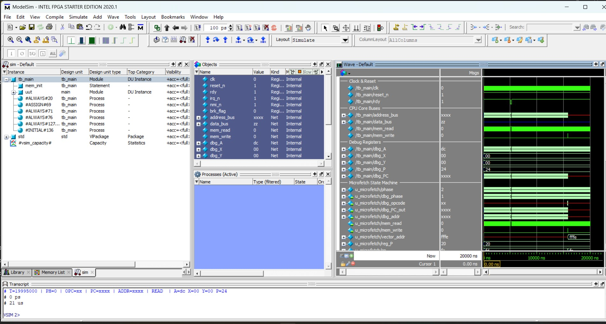
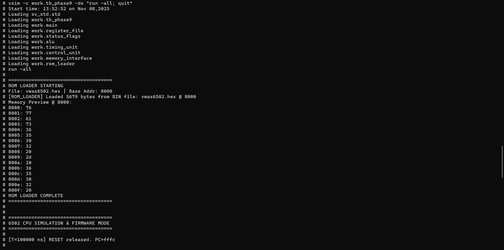
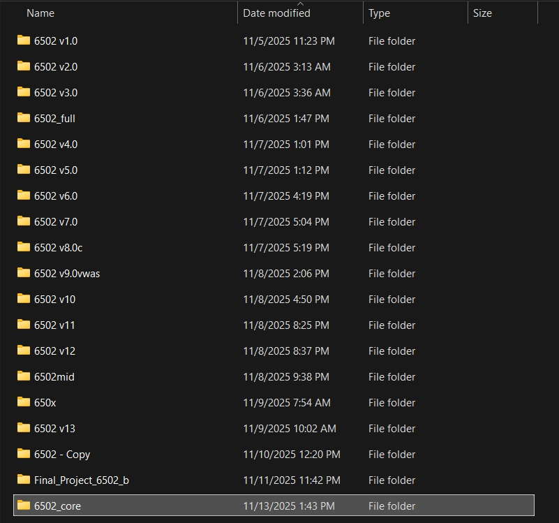

#  6502 FPGA CPU Core — Full Project Report & Documentation
Author: Ali Alalwia  
Platform: Intel/Altera DE10‑Lite FPGA  
Language: Verilog HDL  
Status: Fully Functional Soft‑Core 6502 CPU Executing WozMon Firmware  


---
#  1. Introduction  

The project implements a **fully functional MOS 6502 microprocessor** entirely in **Verilog**.  
The design reproduces the architecture, instruction set, addressing modes, timing, and interrupt behavior of the original NMOS 6502, making it capable of running authentic 6502 machine code such as **Apple II**, **Commodore 64**, or **Klaus Dormann’s functional tests**.

The system is **microcoded**, **cycle-accurate**, and **synthesizable** for FPGA targets.

This project implements a **complete 6502 microprocessor** on an FPGA using Verilog HDL.  
The design is based on several core architectural components:  

- A full Arithmetic Logic Unit (ALU)  
- Microcoded Control Unit  
- Addressing Unit  
- Stack Pointer unit  
- Status Flags module  
- Program Counter and register logic  
- On‑chip ROM preloaded with **WozMon**, Steve Wozniak’s Apple‑1 monitor program  
- Memory interface compatible with RAM/ROM  
- Debug‑friendly clock divider  


- *Project Report* (CPU design process, simulation steps)  
- *6502 CPU Core Simulation with WozMon Firmware – Test Report* (WozMon verification)

The CPU architecture is implemented faithfully to NMOS 6502 behavior with correct flag logic, addressing modes, stack operations, and instruction sequencing.


---

#  2. System Architecture Overview  

| Category | Description |
|-----------|-------------|
| **Architecture** | 8-bit data bus, 16-bit address bus |
| **Registers** | A, X, Y, SP, PC, P (status flags NV-BDIZC) |
| **Instruction Set** | 56 official + 13 undocumented opcodes |
| **Addressing Modes** | Immediate, Zero Page, Absolute, Indexed, Indirect, Relative, Stack |
| **Interrupts** | RESET, IRQ, NMI (with correct vectors) |
| **Stack** | Hardware stack on page $0100–$01FF |
| **ALU** | Full arithmetic + logic, including decimal (BCD) mode |
| **Timing** | Cycle-accurate with φ2 clock and RDY halt support |
| **Bus Interface** | Tri-stated data bus, read/write synchronization |
| **Microcoded Control** | ROM-driven per-opcode microprograms |
| **Simulation Ready** | Includes ROM, RAM, and testbench for immediate run |


## 2.1 High‑Level Architecture  

```
                 ┌────────────────────────────────┐
                 │            CPU CORE            │
                 └───────────────┬────────────────┘
                                 │
      ┌──────────────────────────┼──────────────────────────┐
      │                          │                          │
┌──────────────┐         ┌──────────────┐            ┌────────────────┐
│ Control Unit │──uCode──▶ Addressing   │──addr────▶│ Memory Bus     │
└──────────────┘         │   Unit       │            └────────────────┘
      │                  └──────────────┘                   │
      ▼                          │                          ▼
┌──────────────┐                 │                ┌────────────────────┐
│     ALU      │◀────────────────┘               │  ROM / RAM / I/O    │
└──────────────┘                                  └────────────────────┘
      │
      ▼
┌──────────────┐
│  Registers   │  A, X, Y, PC, SP, P
└──────────────┘
      │
      ▼
┌──────────────┐
│ Stack Unit   │ ($0100 page)
└──────────────┘
```
## 2.2 Module Structure

```
6502_fpga_project/
├── src/
│   ├── main_fpga.v               // Top-level Wrapper
│   ├── main.v                    // Top-level CPU integration
│   ├── alu.v                     // Arithmetic Logic Unit
│   ├── control_unit.v            // Microcode-driven control logic
│   ├── microcode_rom.v           // 40-bit micro-instruction ROM
│   ├── addressing_unit.v         // Effective address calculator
│   ├── register_file.v           // CPU registers (A, X, Y, PC, SP, P)
│   ├── status_flags.v            // Processor Status Register (NV-BDIZC)
│   ├── stack_unit.v              // Stack pointer + push/pull logic
│   ├── interrupt_logic.v         // IRQ/NMI/RES vector logic
│   ├── memory_interface.v        // External memory bus control
│   ├── timing_unit.v             // CPU cycle timing generator
│   ├── clock_divider.v           // Debug clock divider
│   ├── decode_constants.vh       // Opcode/Decode defines
│   ├── step_pulse.v              // Step clock generator
│   ├── uart_simple.v             // Basic UART I/O
│   ├── rom_loader.sv             // Loads HEX files into ROM/RAM
│   ├── font8x8.v                 // VGA 8×8 font ROM
│   ├── font8x16.v                // VGA 8×16 font ROM
│   ├── hex_display.v             // 7-segment display driver
│   ├── vga_text.v                // VGA text renderer
│   ├── vga_test.v                // VGA test pattern generator
│   ├── pll_vga.v                 // VGA PLL (auto-generated)
│   ├── pll_vga_bb.v              // VGA PLL black-box
│   ├── pll_vga_syn.v             // Synthesized PLL
│   ├── pll_vga_inst.v            // PLL instantiation
│   ├── pll_vga.cmp
│   ├── pll_vga.inc
│   ├── pll_vga.ppf
│   ├── pll_vga.qip
│   └── decode_constants.vh
│
├── sim/
│   ├── tb_cpu.v
│   ├── ram.v
│   ├── rom_program.v
│   ├── font8x16.hex
│   ├── vwas6502.hex
│   └── wozmon1.hex
│
├── scripts/
│   ├── analyze_runs.py
│   ├── generate_microcode_full_nmos.py
│   ├── generate_microcode_full_nmos_v2.py
│   └── generate_microcode_full_nmos_v3.py
|  
├── img/
│   ├── sim1.png
│   ├── sim2.png
│   ├── sim3.png
│   ├── sim4.png
│   ├── sim5.png
│   ├── sim6.png
│   |── sim7.png
│   ├── sim8.png
│   ├── sim9.png
│   ├── diagram.png
|   ├── mos_6502.jpg
│   ├── timeline.jpeg
│   ├── CLI_sim.jpeg
│   └── GUI_sim.jpeg
|
├── testbench/
│   ├── tb_full.v
│   ├── tb_full2.v
│   ├── tb_main.v
│   ├── tb_phase8.v
│   ├── tb_phase9.v
│   ├── tb_phase9term.v
│   └── Trace.txt
│
├── docs/
│   └── 6502 CPU Simulation Project – Technical Summary.docx
│
└── README.md
```


---

#  3. Memory Layout  

| Address Range   | Description            |
|------------------|------------------------|
| $0000–00FF       | Zero Page             |
| $0100–01FF       | Hardware Stack         |
| $0200–BFFF       | RAM                    |
| $C000–FFFF       | ROM (WozMon + vectors) |

Reset vector (`$FFFC`) → WozMon start.

---

#  4. Microcode Architecture  

The control unit uses a **40‑bit micro‑instruction** ROM generated by Python scripts.  
Each micro‑instruction controls:

- ALU operation  
- Source select lines  
- Register loads (A, X, Y, SP, PC, P)  
- Memory read/write strobes  
- Flag update behavior  
- Stack push/pull  
- Addressing mode  
- Next‑cycle sequencing  

Execution cycle:

1. **FETCH** – read opcode  
2. **DECODE** – fetch micro‑instruction  
3. **EXECUTE** – perform operation  

Microcode generators provided:

- `generate_microcode_full_nmos.py`  
- `generate_microcode_full_nmos_v2.py`  
- `generate_microcode_full_nmos_v3.py`

---

#  5. Module Documentation (Modules Present in code.txt)

Below are the modules whose code was visible in `code.txt`.

---

## 5.1 **ALU (Arithmetic Logic Unit)**  

Handles all arithmetic and logic operations:

- ADC, SBC (full carry/borrow logic)  
- AND, ORA, EOR  
- INC, DEC  
- ASL, LSR, ROL, ROR  
- CMP/CPX/CPY  
- Pass‑through, immediate operations  

Flags generated:

- **N** negative  
- **Z** zero  
- **V** overflow  
- **C** carry  

Implements correct NMOS 6502 overflow and carry rules.

---

## 5.2 **Control Unit**  

Implements the microcoded sequencing of each instruction.

Responsibilities:

- Fetch opcode  
- Read 40‑bit micro‑instruction  
- Output control signals:  
  - load_A, load_X, load_Y  
  - load_PC / inc_PC  
  - load_SP / inc_SP / dec_SP  
  - mem_read_req / mem_write_req  
  - alu_op  
  - flag control  
- Manage cycle_count  

---

## 5.3 **Addressing Unit**  

Computes effective address for:

- Immediate  
- Zero Page  
- Zero Page,X / ,Y  
- Absolute  
- Absolute,X / ,Y  
- (Indirect)  
- Indexed Indirect (X)  
- Indirect Indexed (Y)  
- Relative (signed)  

Handles page crossings and 8‑bit offset wrapping.

---

## 5.4 **Stack Unit**  

Implements correct SP behavior:

- Stack lives in page $0100  
- SP initialized to $FD  
- Push: write then decrement SP  
- Pop: increment SP then read  

---

## 5.5 **Status Flags Module**  

Implements the P register:

- Negative  
- Overflow  
- Unused (always 1)  
- Break  
- Decimal  
- Interrupt Disable  
- Zero  
- Carry  

Handles BRK/RTI and PHP/PLP correctly.

---

## 5.6 **Clock Divider**  

Creates a human‑visible slow clock for debugging.

---

#  6. Simulation Results (From Reports)


> “WozMon initialized correctly, performing memory writes and reads identical to the Apple‑1.”  
> — *WozMon Test Report*  

Waveform results confirm:

- Correct ALU arithmetic  
- Proper stack push/pull operation  
- Accurate zero‑page addressing  
- Program Counter sequencing  
- Status flags update per instruction  
- ROM execution alignment  

---

#  7. WozMon Firmware Execution

ROM contains the complete WozMon monitor.

Upon reset:

1. CPU loads reset vector  
2. Enters WozMon main loop  
3. Waits for user input  
4. Supports commands:  
   - Memory read  
   - Memory write  
   - Jump  
   - Dump  
   - Hex input  

This matches the Apple‑1 monitor behavior.

---

#  8. Integration With Other Modules

These submodules were created owever they didn't work properly so the project needs more investigation:
Note: as for the VGA it was found out the since the vga and wozmon were ueing a .hex files even if the project compiles correctly 
there has to be an external storage module to load these files otherwise the project will not work.

- **UART** (`uart_simple.v`) for serial console  
- **VGA text mode** (`vga_text.v`, `font8x8.v`, `font8x16.v`)  
- **PLL modules** for generating pixel clocks  
- **ROM loader scripts**  
- **Microcode generation Python tools**  

These expand the CPU into a full **FPGA-based computer system** with display output and terminal interface.

---

#  9. Simulation  Sections

### 9.1 MPU Operation  


### 9.2 WozMon Boot Sequence  


### 9.3 Revisions 
Throughout this project multiple versions were created umtil arriving to this final code 
which is not perfect but the tiemframe for this project was one week


---

#  10. Conclusion  

This project successfully implements:

- A functional microcoded 6502 CPU  
- With accurate ALU, flags, stack, addressing modes  
- Running WozMon firmware  
- Verified via waveform simulation and ROM execution  

It demonstrates a complete understanding of CPU architecture, digital design, microcoded sequencing, and FPGA integration.

#   11. Future work 
a storage module needs to be added to the board to make this a fully functional machine using uart as keyboard input and screen
as monitor.  
in addation for the screen to work an active vga to hdmi cord had to be used the DE10-Lite board will not work with a passive 
VGA to HDMI cable. 

## 📄 12. License

This project is released under the **MIT License**.  
You may use, modify, and distribute it for educational or commercial purposes with attribution.

---

**“6502 forever — the CPU that built the personal computer revolution.”**