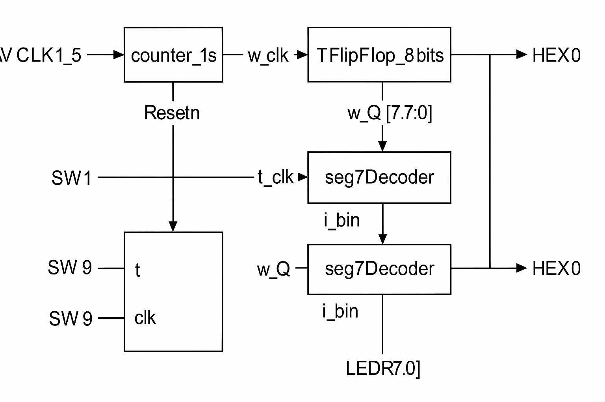
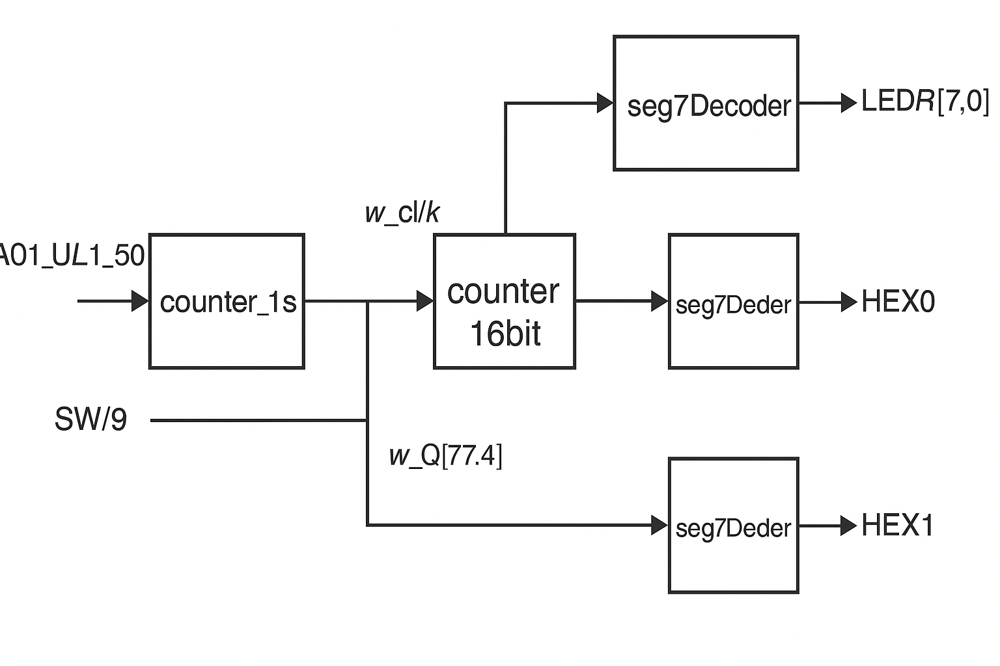
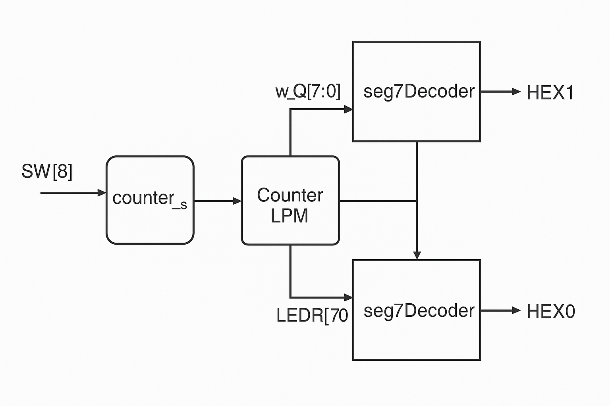
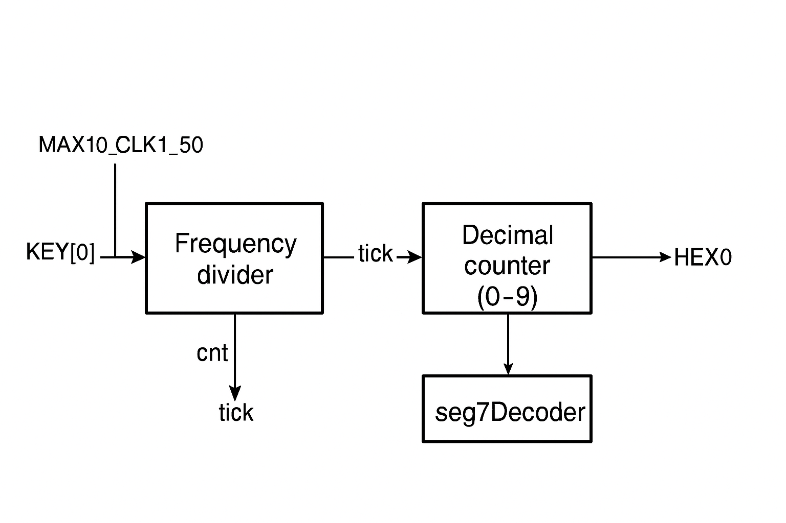
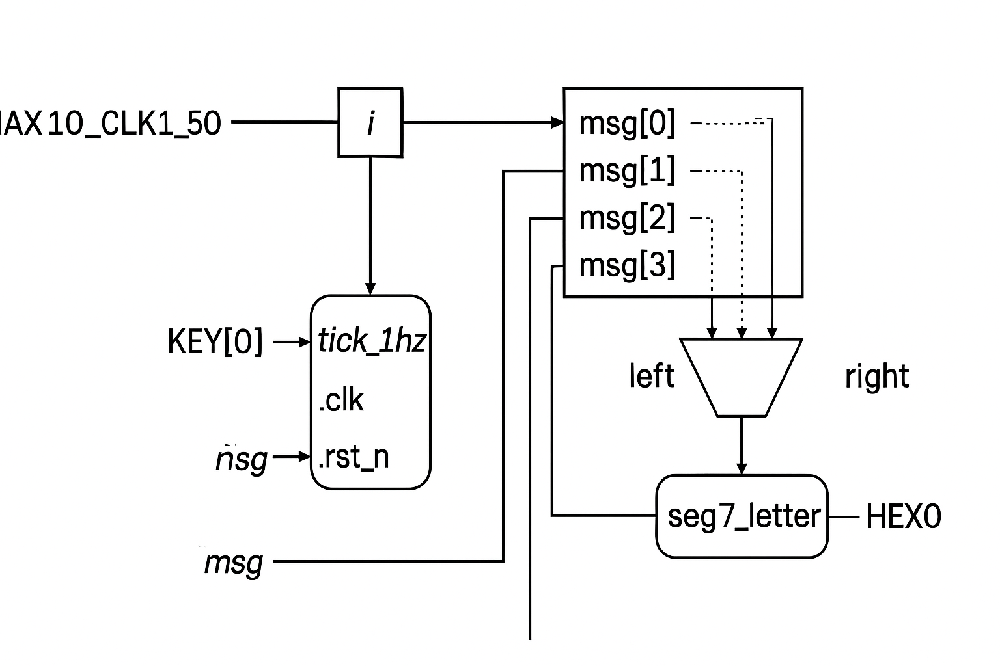

# Laboratory Report – Counters and Sequential Circuits

**Course:** ENEE 2223 – Advanced Digital Systems  
**Platform:** Intel/Altera DE10-Lite FPGA  
**Language:** Verilog HDL  
**Author:** *[Your Name]*  
**Date:** *[Insert Date]*  

---

## Objective

The goal of this laboratory exercise is to design, simulate, and implement various **counters and sequential logic circuits** using Verilog HDL.  
This lab explores synchronous counters, flip-flop–based counters, and LPM-based designs.  
Each part builds on the previous one, culminating in a custom tick-based scrolling message display.

---

## Equipment and Tools

- Intel Quartus Prime  
- ModelSim Simulator  
- Intel/Altera DE10-Lite FPGA  
- MAX10 FPGA device  
- On-board switches (`SW`), push buttons (`KEY`), and 7-segment displays (`HEX0–HEX5`)  

---

## Part I – Basic 8-bit Counter Using T Flip-Flops

### Explanation

In this part, a simple **8-bit counter** is constructed using eight T flip-flops.  
A 1 Hz clock signal is generated using the `counter_1s` module to drive the counter.  
Each T flip-flop toggles its output on every clock pulse, forming a binary up-counter.

**Functional Overview:**
| Signal | Description |
|--------|--------------|
| `SW[8]` | Enables the 1 Hz clock generator |
| `SW[9]` | Asynchronous reset |
| `SW[1]` | T input (toggle control) |
| `LEDR[7:0]` | Binary count output |
| `HEX0–HEX1` | Display counter value in hexadecimal |

---

### Verilog Code

```verilog
wire w_clk;

// Generate 1 Hz clock pulse
counter_1s C0 (MAX10_CLK1_50, SW[8], w_clk);

wire [7:0] w_Q;

// 8-bit counter using T flip-flops
TFlipFlop_8bits counter8bit (SW[1], w_clk, SW[9], w_Q);

// Display counter value
seg7Decoder Ones(w_Q[3:0], HEX0);
seg7Decoder Tens(w_Q[7:4], HEX1);
```

---

### Block Diagram
![Block Diagram – 8-bit T Flip-Flop Counter]<br/>


---

### FPGA Board Photo
![FPGA Board – 8-bit Counter Output]<br/>


---

## Part II – 8-bit Counter Using `counter_16bit` Module

### Explanation

This part replaces the discrete flip-flops with a **predefined counter module** named `counter_16bit`.  
It counts using the same 1 Hz clock generated by `counter_1s` but simplifies implementation by encapsulating counting logic in a reusable block.

**Functional Overview:**
| Signal | Description |
|--------|--------------|
| `SW[8]` | Clock enable |
| `SW[9]` | Reset |
| `LEDR[7:0]` | Count output |
| `HEX0–HEX1` | Displays lower 8-bit counter value |

---

### Verilog Code

```verilog
wire w_clk;

// Generate 1 Hz clock pulse
counter_1s C0 (MAX10_CLK1_50, SW[8], w_clk);

wire [7:0] w_Q;

// Counter using parameterized 16-bit module
counter_16bit(w_clk, SW[9], w_Q);

// Display value on HEX0–HEX1
seg7Decoder Ones(w_Q[3:0], HEX0);
seg7Decoder Tens(w_Q[7:4], HEX1);
```

---

### Block Diagram
![Block Diagram – 8-bit counter_16bit Module]<br/>


---

### FPGA Board Photo
![FPGA Board – 8-bit counter_16bit Output]<br/>


---

## Part III – 8-bit Counter Using LPM (Library of Parameterized Modules)

### Explanation

The **LPM counter** (`Counter_LPM`) is an Intel-provided hardware-optimized counter.  
It simplifies design and ensures synthesis efficiency on FPGA devices.  
It supports parameter configuration for size, direction, and enable control.

**Functional Overview:**
| Signal | Description |
|--------|--------------|
| `SW[0]` | Enable counter |
| `SW[8]` | Enable 1 Hz tick generator |
| `SW[9]` | Reset |
| `HEX0–HEX1` | Displays LPM counter value |

---

### Verilog Code

```verilog
wire w_clk;

// 1 Hz Clock generator
counter_1s C0 (MAX10_CLK1_50, SW[8], w_clk);

wire [7:0] w_Q;

// LPM-based counter
Counter_LPM CLPM (SW[0], w_clk, SW[9], w_Q);

// Display lower and higher digits
seg7Decoder Ones(w_Q[3:0], HEX0);
seg7Decoder Tens(w_Q[7:4], HEX1);
```

---

### Block Diagram
![Block Diagram – LPM Counter]<br/>

---

### FPGA Board Photo
![FPGA Board – LPM Counter Output]<br/>


---

## Part IV – Decimal Digit Counter (0–9)

### Explanation

This part implements a **single-digit counter** that increments every second and resets after reaching 9.  
The circuit uses a frequency divider to produce a 1 Hz tick from the 50 MHz FPGA clock.  
Each tick increments the decimal digit, displayed on `HEX0`.

**Functional Overview:**
| Signal | Description |
|--------|--------------|
| `KEY[0]` | Active-low reset |
| `HEX0` | Displays decimal count (0–9) |

---

### Verilog Code

```verilog
wire rst_n = KEY[0];

reg [25:0] cnt;
reg tick;

// 1 Hz tick generator
always @(posedge MAX10_CLK1_50 or negedge rst_n) begin
  if (!rst_n) begin
    cnt  <= 0;
    tick <= 0;
  end else if (cnt == 50_000_000-1) begin
    cnt  <= 0;
    tick <= 1;
  end else begin
    cnt  <= cnt + 1;
    tick <= 0;
  end
end

// Single digit counter
reg [3:0] digit;
always @(posedge MAX10_CLK1_50 or negedge rst_n) begin
  if (!rst_n)
    digit <= 0;
  else if (tick)
    digit <= (digit == 9) ? 0 : digit + 1;
end

seg7Decoder h0(.i_bin(digit), .o_HEX(HEX0));
```

---

### Block Diagram
![Block Diagram – Decimal Digit Counter]<br/>

---

### FPGA Board Photo
![FPGA Board – Decimal Counter Output]<br/>


---

## Part V – Scrolling HELLO Message Display

### Explanation

The final part implements a **scrolling message display** on two 7-segment displays.  
A 1 Hz tick is generated using the `tick_1hz` module.  
Characters of the word “HELLO” are encoded as numerical codes and shifted cyclically across two displays (`HEX0` and `HEX1`).

**Functional Overview:**
| Signal | Description |
|--------|--------------|
| `KEY[0]` | Reset |
| `HEX1–HEX0` | Display scrolling message |
| `tick_1hz` | Generates 1-second tick signal |

stores the word HELLO using simple numeric codes:

0 → H

1 → E

2 → L

3 → O

So msg = [H, E, L, L, O].

Each code (3 bits wide) will later be translated to the proper 7-segment pattern by seg7_letter.

'i' selects the current “window position” in the message.

It increments by 1 every tick (once per second).

When it reaches 4, it wraps around to 0.

➜ In effect, the index cycles through 0–4 repeatedly once per second.
---

### Verilog Code

```verilog
wire rst_n = KEY[0];
wire tick;
tick_1hz u_tick(.clk(MAX10_CLK1_50), .rst_n(rst_n), .tick(tick));

// HELLO as codes: H=0, E=1, L=2, L=2, O=3
reg [2:0] msg [0:4];
initial begin
	msg[0]=3'd0; msg[1]=3'd1; msg[2]=3'd2; msg[3]=3'd2; msg[4]=3'd3;
end

reg [2:0] i;  // 0..4, index of left character in the window
always @(posedge MAX10_CLK1_50 or negedge rst_n) begin
if (!rst_n) i <= 3'd0;
else if (tick) i <= (i==3'd4) ? 3'd0 : i + 3'd1;
end

wire [2:0] left  = msg[i];
wire [2:0] right = msg[(i==3'd4)? 3'd0 : i+3'd1];

seg7_letter L (.code(left),  .HEX(HEX1));
seg7_letter R (.code(right), .HEX(HEX0));
```

---

### Block Diagram
![Block Diagram – Scrolling HELLO Display]<br/>

---

### FPGA Board Photo
![FPGA Board – HELLO Display Output]<br/>

---

## Discussion

| Concept | Key Takeaway |
|----------|---------------|
| T Flip-Flop Counters | Demonstrate basic synchronous counting behavior. |
| Counter Modules | Simplify hardware design and reuse logic. |
| LPM Counters | Offer parameterization and hardware optimization. |
| Tick Generators | Allow precise timing control for visible output cycles. |
| Scrolling Displays | Combine timing and sequential logic to create visual effects. |

---

## Conclusion

This lab explored multiple implementations of counters in Verilog HDL.  
By comparing T flip-flop, structural, and LPM-based designs, we gained insights into scalability, clock division, and timing management on FPGA hardware.  
The final scrolling display demonstrated integration of counting logic with memory and output multiplexing.

---

## Appendix – Supporting Verilog Modules

### T Flip-Flop (1-bit)
```verilog
module TFlipFlop (
	input T, clk, rst,
	output reg Q
);
	always @(posedge clk or posedge rst)
		if (rst) Q <= 0;
		else if (T) Q <= ~Q;
endmodule
```

### 8-bit T Flip-Flop Counter
```verilog
module TFlipFlop_8bits(
	input T, clk, rst,
	output [7:0] Q
);
	genvar i;
	generate
		for (i=0; i<8; i=i+1) begin : loop
			TFlipFlop tff(
				.T(T),
				.clk(clk),
				.rst(rst),
				.Q(Q[i])
			);
		end
	endgenerate
endmodule
```

### 1-Second Counter
```verilog
module counter_1s(
	input clk,
	input en,
	output reg tick
);
	reg [25:0] cnt;
	always @(posedge clk) begin
		if (!en) begin
			cnt <= 0; tick <= 0;
		end else if (cnt == 50_000_000-1) begin
			cnt <= 0; tick <= 1;
		end else begin
			cnt <= cnt + 1; tick <= 0;
		end
	end
endmodule
```

### 16-bit Counter
```verilog
module counter_16bit(
	input clk, clr,
	output reg [7:0] q
);
	always @(posedge clk or posedge clr)
		if (clr) q <= 0;
		else q <= q + 1;
endmodule
```

### Tick Generator 1Hz
```verilog
module tick_1hz(
	input clk, rst_n,
	output reg tick
);
	reg [25:0] cnt;
	always @(posedge clk or negedge rst_n) begin
		if (!rst_n) begin
			cnt <= 0; tick <= 0;
		end else if (cnt == 50_000_000-1) begin
			cnt <= 0; tick <= 1;
		end else begin
			cnt <= cnt + 1; tick <= 0;
		end
	end
endmodule
```

### 7-Segment Letter Decoder (HELLO)
```verilog
module seg7_letter (
	input [2:0] code,
	output reg [7:0] HEX
);
	always @(*) begin
		case(code)
			3'd0: HEX = 8'b10001000; // H
			3'd1: HEX = 8'b10001110; // E
			3'd2: HEX = 8'b11010110; // L
			3'd3: HEX = 8'b11000000; // O
			default: HEX = 8'b11111111;
		endcase
	end
endmodule
```

---

## References

- *Laboratory Exercise 5 – Counters and Sequential Circuits*, Altera University Program  
- ENEE 2223 Course Lecture Notes and Materials  

---

