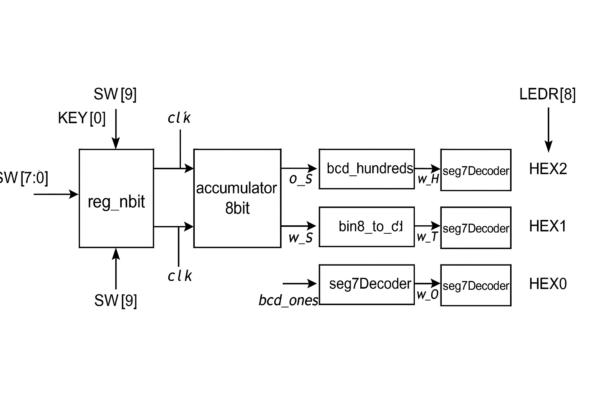
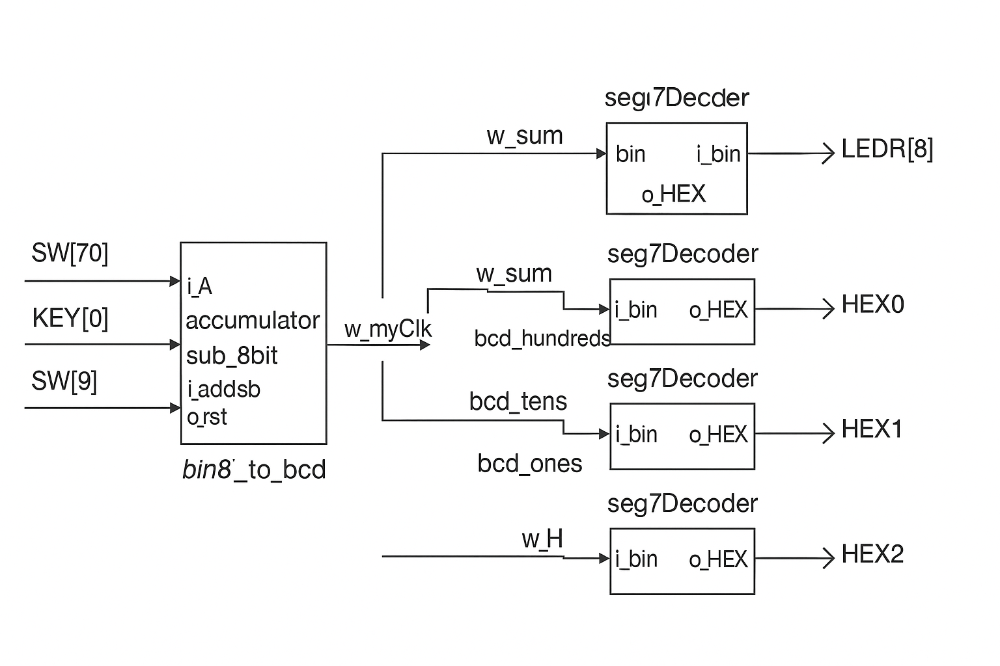
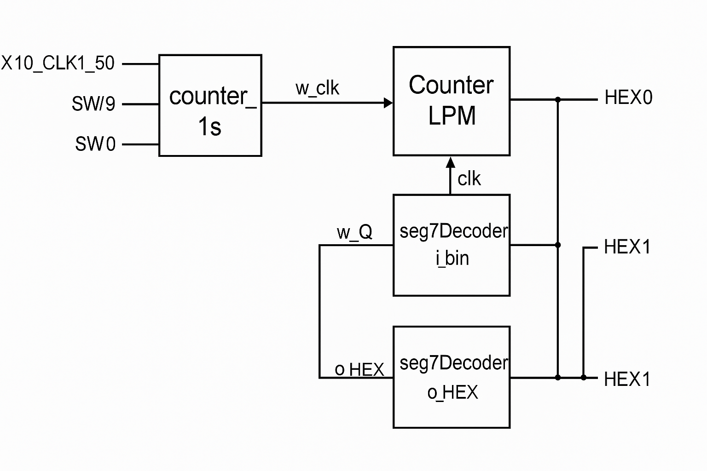
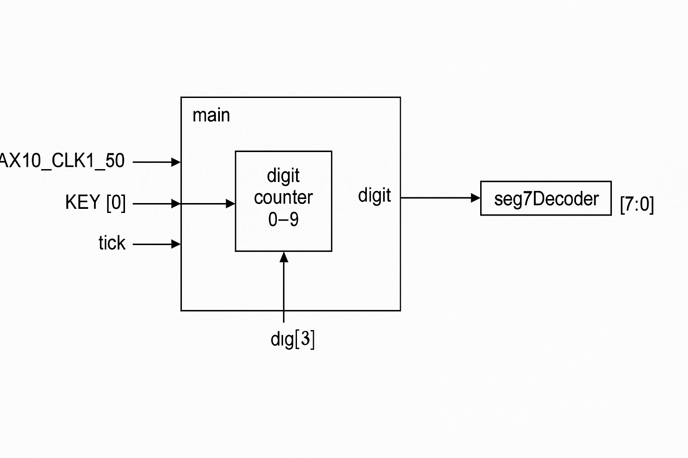
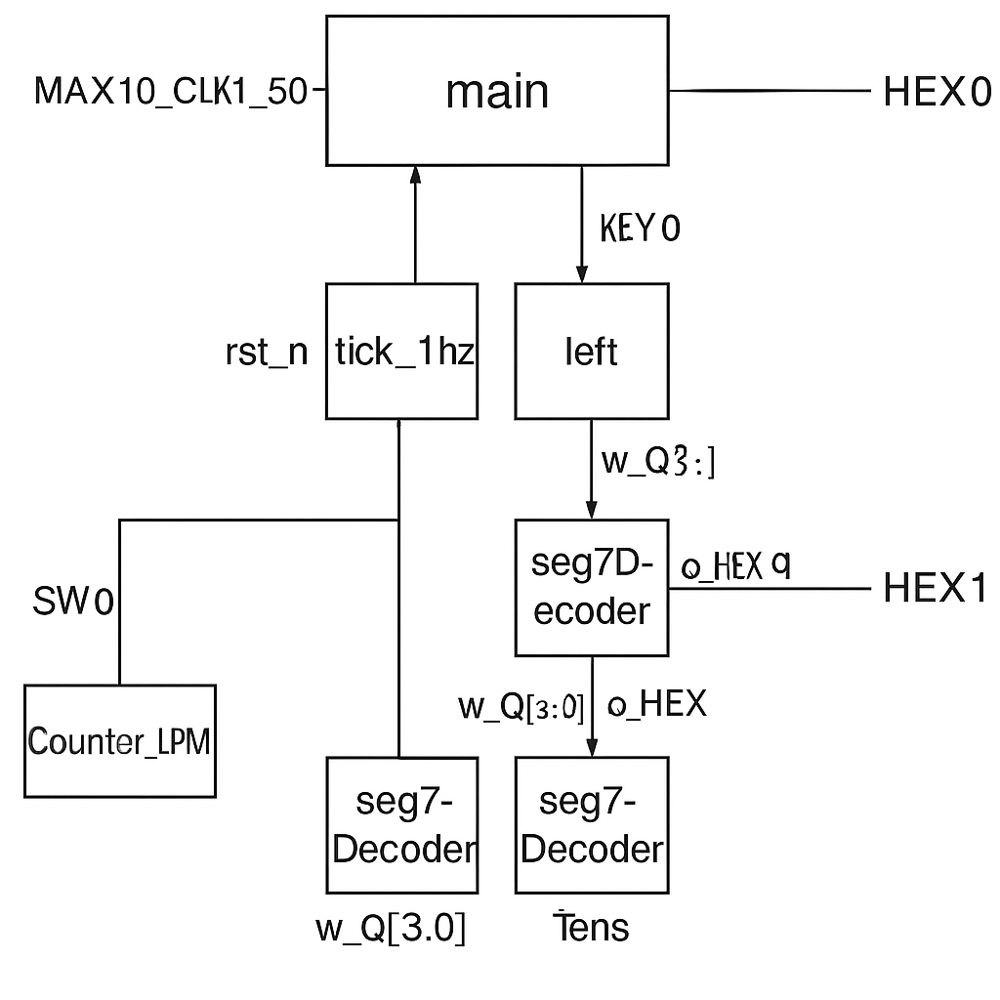

# Laboratory Report – Adders, Subtractors, and Multipliers

**Course:** ENEE 2223 – Advanced Digital Systems  
**Platform:** Intel/Altera DE10-Lite FPGA  
**Language:** Verilog HDL  
**Author:** *[Your Name]*  
**Date:** *[Insert Date]*  

---

## Objective

The purpose of this laboratory exercise is to design, simulate, and implement **arithmetic circuits** in Verilog HDL, including adders, subtractors, and multipliers.  
Each part increases in complexity, starting with an accumulator and ending with a high-performance adder-tree multiplier.  
This lab demonstrates the trade-offs between circuit complexity, propagation delay, and hardware efficiency.

---

## Equipment and Tools

- Intel Quartus Prime (or Quartus II)  
- ModelSim Simulator  
- Intel/Altera DE10-Lite FPGA Board  
- MAX10 FPGA Chip  
- Push-buttons, switches, and 7-segment displays  

---

## Part I – 8-Bit Accumulator (Adder)

### Explanation

This circuit functions as an **8-bit accumulator** that adds the input value `A` from switches `SW[7:0]` to a stored register value on every clock pulse.  
When the `KEY[0]` button (manual clock) is pressed, the accumulator sums the new input with the previous total.  
A debounce circuit is used to ensure clean clock transitions.  

**Functional Overview:**
| Signal | Description |
|--------|--------------|
| `SW[7:0]` | Input value A |
| `KEY[0]` | Clock input (debounced) |
| `SW[9]` | Active-high reset |
| `LEDR[7:0]` | Sum output |
| `LEDR[8]` | Overflow indicator |
| `HEX0–HEX2` | Decimal display of sum |

The 8-bit result is converted to **BCD** and displayed using the 7-segment displays.

---

### Verilog Code

```verilog
reg_nbit REG0(
	.i_R(SW[7:0]),
	.i_clk(w_myClk),
	.i_rst(SW[9]),
	.o_Q(LEDR[7:0])
);

wire [7:0] w_sum;

accumulator_8bit Acc_8bit(
	.i_A(SW[7:0]),
	.i_clk(w_myClk),
	.i_rst(SW[9]),
	.o_overflow(LEDR[8]),
	.o_S(w_sum)
);

wire [3:0] w_O, w_T, w_H;

bin8_to_bcd u_b2b (
	.bin(w_sum),
	.bcd_hundreds(w_H),
	.bcd_tens(w_T),
	.bcd_ones(w_O)
);

seg7Decoder SEG_O (w_O, HEX0);
seg7Decoder SEG_T (w_T, HEX1);
seg7Decoder SEG_H (w_H, HEX2);
```

---

### Block Diagram
![Block Diagram – 8-bit Accumulator]<br/>

---

### FPGA Board Photo
![FPGA Board – 8-bit Accumulator Output]<br/>

---

## Part II – Adder–Subtractor

### Explanation

This design extends the accumulator by adding a **mode control input (`SW[8]`)** that determines whether the circuit performs **addition or subtraction**.  
The subtraction is implemented using **two’s complement arithmetic**, allowing the same hardware to handle both operations efficiently.

**Functional Overview:**
| Signal | Description |
|--------|--------------|
| `SW[7:0]` | Input value A |
| `SW[8]` | Add/Subtract selector (0 = Add, 1 = Subtract) |
| `SW[9]` | Reset |
| `LEDR[8]` | Overflow indicator |
| `HEX0–HEX2` | Decimal display of result |

---

### Verilog Code

```verilog
wire [7:0] w_sum;

accumulator_sub_8bit Acc__sub_8bit(
	.i_A(SW[7:0]),
	.i_addsub(SW[8]),
	.i_clk(w_myClk),
	.i_rst(SW[9]),
	.o_overflow(LEDR[8]),
	.o_S(w_sum)
);

assign LEDR[7:0] = w_sum;

wire [3:0] w_O, w_T, w_H;

bin8_to_bcd u_b2b (
	.bin(w_sum),
	.bcd_hundreds(w_H),
	.bcd_tens(w_T),
	.bcd_ones(w_O)
);

seg7Decoder SEG_O (w_O, HEX0);
seg7Decoder SEG_T (w_T, HEX1);
seg7Decoder SEG_H (w_H, HEX2);
```

---

### Block Diagram
![Block Diagram – Adder–Subtractor]<br/>


---

### FPGA Board Photo
![FPGA Board – Adder–Subtractor Output]<br/>

---

## Part III – 4×4 Array Multiplier

### Explanation

This circuit implements a **4×4-bit binary multiplier** using the **array multiplication** method.  
Each bit of operand `B` generates a partial product with operand `A` using AND gates.  
The partial products are then summed using **full adders** in a structured matrix.  

**Functional Overview:**
| Signal | Description |
|--------|--------------|
| `SW[3:0]` | Input A (4-bit) |
| `SW[7:4]` | Input B (4-bit) |
| `LEDR[7:0]` | Product result |
| `LEDR[8]` | Overflow indicator |
| `HEX0–HEX2` | Decimal product output |
| `HEX4–HEX5` | Input values display |

---

### Verilog Code

```verilog
assign HEX3 = 8'b11111111;
seg7Decoder SEG_A (SW[3:0], HEX4);
seg7Decoder SEG_B (SW[7:4], HEX5);

wire [7:0] w_Product;

multiplier_4x4 MT_4by4 (
	.i_A(SW[3:0]),
	.i_B(SW[7:4]),
	.o_P(w_Product),
	.o_Overflow(LEDR[8])
);

assign LEDR[7:0] = w_Product;

wire [3:0] w_O, w_T, w_H;

bin8_to_bcd u_b2b (
	.bin(w_Product),
	.bcd_hundreds(w_H),
	.bcd_tens(w_T),
	.bcd_ones(w_O)
);

seg7Decoder SEG_O (w_O, HEX0);
seg7Decoder SEG_T (w_T, HEX1);
seg7Decoder SEG_H (w_H, HEX2);
```

---

### Block Diagram
![Block Diagram – 4×4 Array Multiplier]<br/>


---

### FPGA Board Photo
![FPGA Board – 4×4 Array Multiplier Output]<br/>

---

## Part IV – 8×8 Registered Multiplier

### Explanation

This circuit expands the multiplier to **8×8 bits** and introduces **registers** to pipeline inputs and outputs.  
Registering both operands and the product stabilizes data flow and allows higher operating frequencies.

**Functional Overview:**
| Signal | Description |
|--------|--------------|
| `SW[7:0]` | Input B |
| Constant A = 100 | Fixed value stored in register |
| `SW[9]` | Reset |
| `LEDR[8:0]` | Binary product output |
| `HEX0–HEX4` | Product display |

---

### Verilog Code

```verilog
wire w_rst = SW[9];
wire [7:0] w_Q_A, w_Q_B;

reg_nbit #(8) REG_A (
	.i_R(8'd100),
	.i_clk(w_myClk),
	.i_rst(w_rst),
	.o_Q(w_Q_A)
);

reg_nbit #(8) REG_B (
	.i_R(SW[7:0]),
	.i_clk(w_myClk),
	.i_rst(w_rst),
	.o_Q(w_Q_B)
);

wire [15:0] w_Product;

multiplier_8x8 MT_8by8 (
	.i_A(w_Q_A),
	.i_B(w_Q_B),
	.o_P(w_Product),
	.o_Overflow(LEDR[9])
);

assign LEDR[8:0] = w_Product[8:0];

wire [15:0] w_reg_Product;

reg_nbit #(16) REG_P (
	.i_R(w_Product),
	.i_clk(w_myClk),
	.i_rst(w_rst),
	.o_Q(w_reg_Product)
);
```

---

### Block Diagram
![Block Diagram – 8×8 Registered Multiplier]<br/>


---

### FPGA Board Photo
![FPGA Board – 8×8 Multiplier Output]<br/>

---

## Part V – 4×4 Adder-Tree Multiplier

### Explanation

This final section implements a **4×4 adder-tree multiplier** — an optimized design that adds partial products **in parallel** using an adder-tree structure.  
The parallelism significantly reduces the propagation delay compared to sequential accumulation.

**Functional Overview:**
| Signal | Description |
|--------|--------------|
| `SW[7:4]` | Input A |
| `SW[3:0]` | Input B |
| `SW[9]` | Reset |
| `LEDR[8:0]` | Binary product output |
| `HEX0–HEX2` | Decimal result display |

---

### Verilog Code

```verilog
wire w_rst = SW[9];
wire [3:0] w_Q_A, w_Q_B;

reg_nbit #(4) REG_A (
	.i_R(SW[7:4]),
	.i_clk(w_myClk),
	.i_rst(w_rst),
	.o_Q(w_Q_A)
);

reg_nbit #(4) REG_B (
	.i_R(SW[3:0]),
	.i_clk(w_myClk),
	.i_rst(w_rst),
	.o_Q(w_Q_B)
);

wire [7:0] w_Product;

multiplier_4x4_addertree MT_4by4 (
	.i_A(w_Q_A),
	.i_B(w_Q_B),
	.o_P(w_Product),
	.o_Overflow(LEDR[9])
);

assign LEDR[8:0] = w_Product[7:0];

wire [7:0] w_reg_Product;

reg_nbit #(8) REG_P (
	.i_R(w_Product),
	.i_clk(w_myClk),
	.i_rst(w_rst),
	.o_Q(w_reg_Product)
);
```

---

### Block Diagram
![Block Diagram – 4×4 Adder-Tree Multiplier]<br/>


---

### FPGA Board Photo
![FPGA Board – 4×4 Adder-Tree Multiplier Output]<br/>

---

## Discussion

| Concept | Key Takeaway |
|----------|---------------|
| Ripple Adders | Easy to implement but slower for larger bit-widths due to carry propagation delay. |
| Subtractor | Efficiently implemented via two’s complement arithmetic. |
| Array Multiplier | Structured and regular but not optimal for high-speed design. |
| Registered Multiplier | Increases stability and maximum frequency through pipelining. |
| Adder-Tree Multiplier | Fastest implementation, reduces critical path delay by parallel summing. |

---

## Conclusion

This lab provided practical experience in designing and implementing arithmetic circuits using Verilog HDL.  
Each part built on the previous, progressing from simple addition to parallelized multiplication.  
By observing timing, overflow, and hardware utilization, we learned the relationship between **speed, complexity, and resource usage** in digital systems.

---

## Appendix – Supporting Verilog Modules

### Debounce Module
```verilog
module debounce (
	input clk,
	input rst,
	input btn_raw,
	output reg btn_level,
	output reg btn_pressed,
	output reg btn_released
);
	reg [15:0] counter;
	reg btn_sync_0, btn_sync_1;
	always @(posedge clk) begin
		btn_sync_0 <= btn_raw;
		btn_sync_1 <= btn_sync_0;
	end
	always @(posedge clk or posedge rst) begin
		if (rst) begin
			counter <= 0;
			btn_level <= 0;
			btn_pressed <= 0;
			btn_released <= 0;
		end else begin
			if (btn_sync_1 == btn_level)
				counter <= 0;
			else begin
				counter <= counter + 1;
				if (counter == 16'hffff) begin
					btn_level <= btn_sync_1;
					btn_pressed <= (btn_sync_1 == 1);
					btn_released <= (btn_sync_1 == 0);
				end
			end
		end
	end
endmodule
```

### n-bit Register
```verilog
module reg_nbit #(parameter N = 8)(
	input [N-1:0] i_R,
	input i_clk,
	input i_rst,
	output reg [N-1:0] o_Q
);
	always @(posedge i_clk or posedge i_rst)
		if (i_rst) o_Q <= 0;
		else o_Q <= i_R;
endmodule
```

### 8-bit Accumulator
```verilog
module accumulator_8bit (
	input [7:0] i_A,
	input i_clk, i_rst,
	output reg o_overflow,
	output reg [7:0] o_S
);
	reg [8:0] acc;
	always @(posedge i_clk or posedge i_rst)
		if (i_rst)
			acc <= 0;
		else
			acc <= acc + i_A;
	assign o_S = acc[7:0];
	assign o_overflow = acc[8];
endmodule
```

### Adder–Subtractor
```verilog
module accumulator_sub_8bit (
	input [7:0] i_A,
	input i_addsub, i_clk, i_rst,
	output reg o_overflow,
	output reg [7:0] o_S
);
	reg [8:0] acc;
	always @(posedge i_clk or posedge i_rst)
		if (i_rst)
			acc <= 0;
		else if (i_addsub)
			acc <= acc - i_A;
		else
			acc <= acc + i_A;
	assign o_S = acc[7:0];
	assign o_overflow = acc[8];
endmodule
```

### 4×4 Multiplier
```verilog
module multiplier_4x4(
	input [3:0] i_A, i_B,
	output [7:0] o_P,
	output o_Overflow
);
	assign {o_Overflow, o_P} = i_A * i_B;
endmodule
```

### 8×8 Multiplier
```verilog
module multiplier_8x8(
	input [7:0] i_A, i_B,
	output [15:0] o_P,
	output o_Overflow
);
	assign {o_Overflow, o_P} = i_A * i_B;
endmodule
```

### 4×4 Adder Tree Multiplier
```verilog
module multiplier_4x4_addertree(
	input [3:0] i_A, i_B,
	output [7:0] o_P,
	output o_Overflow
);
	wire [7:0] partial0 = i_B[0] ? {4'b0000, i_A} : 8'b0;
	wire [7:0] partial1 = i_B[1] ? {3'b000, i_A, 1'b0} : 8'b0;
	wire [7:0] partial2 = i_B[2] ? {2'b00, i_A, 2'b00} : 8'b0;
	wire [7:0] partial3 = i_B[3] ? {1'b0, i_A, 3'b000} : 8'b0;
	wire [7:0] sum1 = partial0 +

