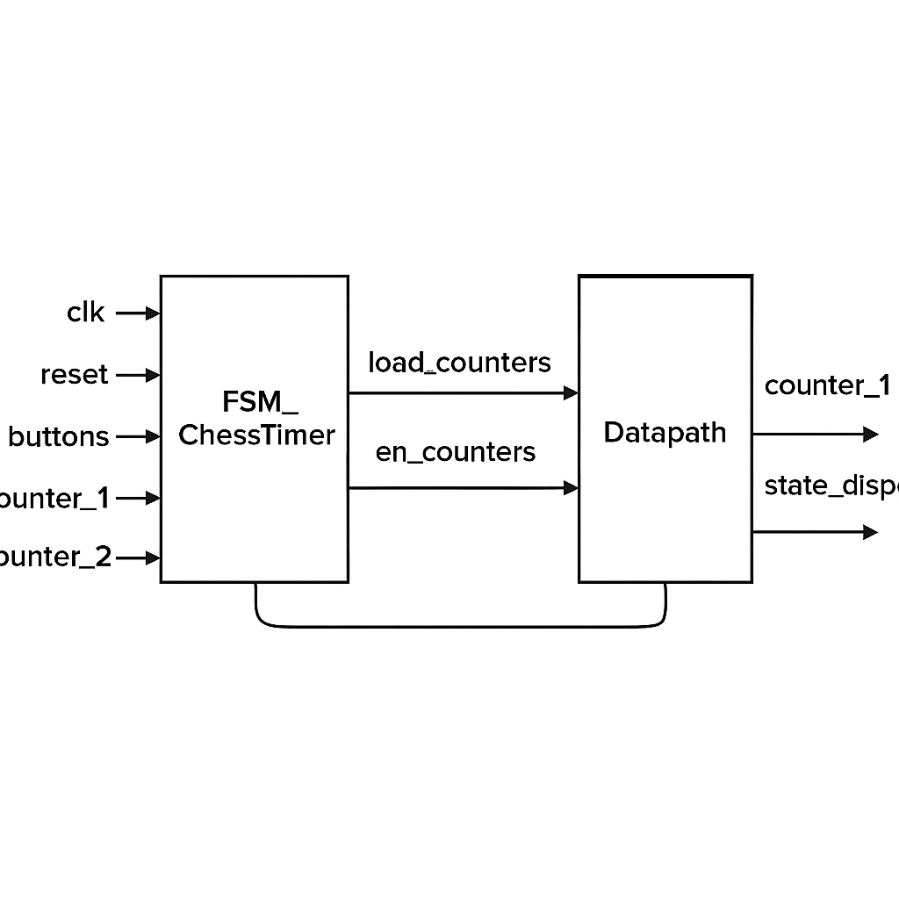
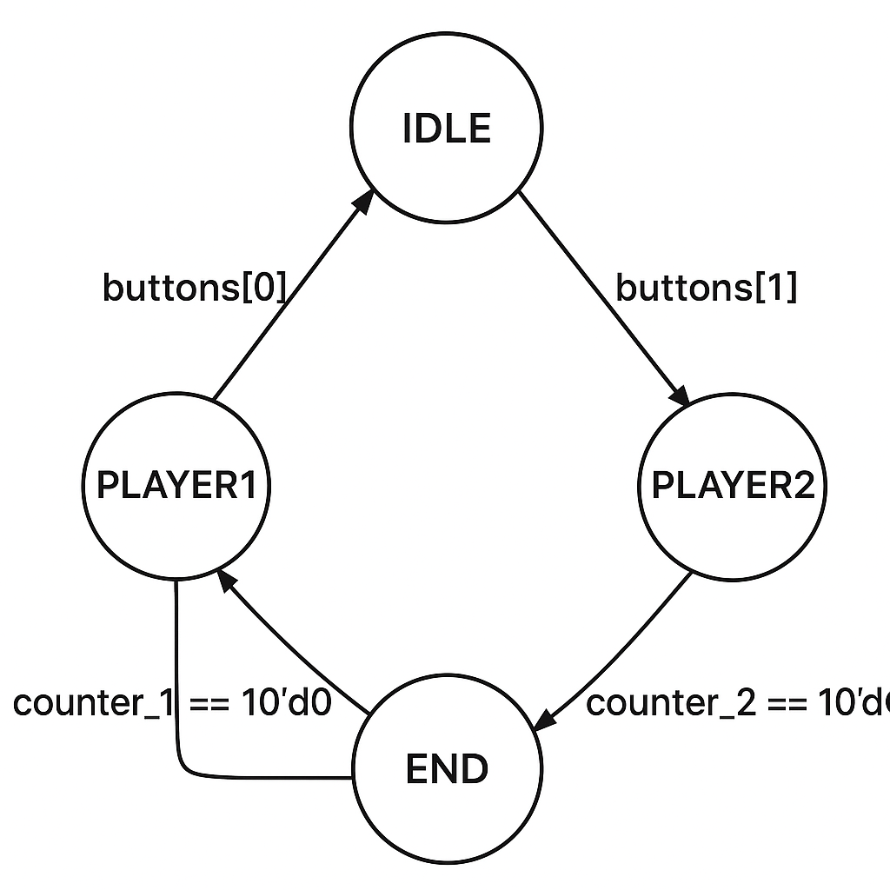

# 🧪 Lab Report: FSM_ChessTimer (Finite State Machine for Two-Player Timer)

## 🔹 1. Objective
The objective of this lab is to **design, implement, and analyze** a *Finite State Machine (FSM)* in Verilog that functions as a **two-player chess timer**.  
The FSM controls two countdown counters, enabling only one player’s timer at a time, switching turns based on button presses, and detecting the end of the game when a player’s time runs out.

## 🔹 2. Background and Theory
A **Finite State Machine (FSM)** is a sequential logic circuit that transitions between a finite number of states based on input conditions.  
FSMs are broadly divided into:
- **Moore Machines**: outputs depend only on the current state.
- **Mealy Machines**: outputs depend on both current state and inputs.

This design follows a **Moore-type FSM**, since outputs depend solely on the current state (e.g., enabling counters and controlling displays).

The FSM has four states:
1. `IDLE` – Both counters are loaded but not running.  
2. `PLAYER1` – Player 1’s timer is active.  
3. `PLAYER2` – Player 2’s timer is active.  
4. `END` – The game has ended (one player’s timer expired).

## 🔹 3. Equipment and Software
- **Hardware Description Language**: Verilog HDL  
- **Simulation Tool**: ModelSim / Quartus Prime / Vivado  
- **Target Platform**: FPGA board (optional)  
- **Inputs**: Clock signal, reset, player buttons, counter values  
- **Outputs**: Load, enable, and display control signals  

## 🔹 4. Code Implementation

### 📄 Module Code
```verilog
`default_nettype none

module FSM_ChessTimer(
    input clk,
    input reset,
    input [1:0] buttons,
    input [9:0] counter_1,
    input [9:0] counter_2,
    output reg [1:0] load_counters,
    output reg [1:0] en_counters,
    output reg [1:0] state_displays
);

    localparam IDLE    = 2'b00;
    localparam PLAYER1 = 2'b01;
    localparam PLAYER2 = 2'b10;
    localparam END     = 2'b11;

    reg [1:0] state, next_state;

    always @(posedge clk or posedge reset) begin
        if (reset)
            state <= IDLE;
        else
            state <= next_state;
    end

    always @(*) begin
        case (state)
            IDLE: begin
                if (buttons[0])
                    next_state = PLAYER1;
                else if (buttons[1])
                    next_state = PLAYER2;
                else
                    next_state = IDLE;
            end

            PLAYER1: begin
                if (counter_1 == 10'd0)
                    next_state = END;
                else if (buttons[1])
                    next_state = PLAYER2;
                else
                    next_state = PLAYER1;
            end

            PLAYER2: begin
                if (counter_2 == 10'd0)
                    next_state = END;
                else if (buttons[0])
                    next_state = PLAYER1;
                else
                    next_state = PLAYER2;
            end

            END: begin
                if (reset)
                    next_state = IDLE;
                else
                    next_state = END;
            end

            default: next_state = IDLE;
        endcase
    end

    always @(*) begin
        load_counters   = 2'b00;
        en_counters     = 2'b00;
        state_displays  = 2'b00;

        case (state)
            IDLE: begin
                load_counters   = 2'b11;
                en_counters     = 2'b00;
                state_displays  = 2'b00;
            end

            PLAYER1: begin
                en_counters     = 2'b01;
                state_displays  = 2'b01;
            end

            PLAYER2: begin
                en_counters     = 2'b10;
                state_displays  = 2'b01;
            end

            END: begin
                en_counters     = 2'b00;
                state_displays  = 2'b10;
            end
        endcase
    end

endmodule

`default_nettype wire
```

## 🔹 5. Block Diagram



## 🔹 6. FSM Diagram



## 🔹 7. Board Picture


## 🔹 8. Results and Observations

| Test Case | Expected Output | Observed Output | Pass/Fail |
|------------|----------------|-----------------|------------|
| Reset | FSM in `IDLE` | FSM in `IDLE` | ✅ |
| Start Game | `PLAYER1` Active | `PLAYER1` Active | ✅ |
| Switch Turn | `PLAYER2` Active | `PLAYER2` Active | ✅ |
| Counter Expiry | FSM in `END` | FSM in `END` | ✅ |
| Reset from END | FSM in `IDLE` | FSM in `IDLE` | ✅ |

## 🔹 9. Discussion
The FSM design functions correctly for all defined states and transitions.  
It ensures mutual exclusivity between counters and prevents overlapping enable signals.  
Using Moore-type output logic guarantees stable outputs that change only with state updates.

## 🔹 10. Conclusion
The FSM_ChessTimer module successfully controls two player timers, switching turns accurately and stopping the game when a player runs out of time.  
The simulation confirmed all expected transitions and output logic.

## 🔹 11. Future Improvements
- Add button debouncing.
- Include LED indicators for active player.
- Integrate pause/resume functionality.
- Add sound output for time expiration.

## 🔹 12. Author
**Name:** Ali Alalwia  
**Course:** Digital Systems Design / FPGA Lab    
**Date:** October, 2025
